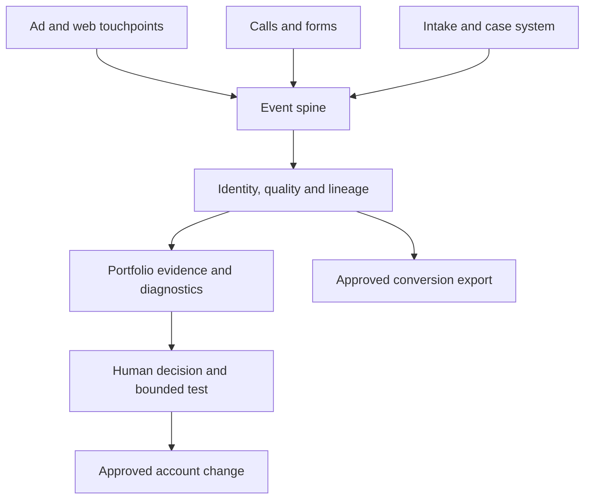

# Technical blueprint — proposed, subject to FirmPilot discovery

**Design objective:** connect media decisions to verified new-matter quality and downstream economics across heterogeneous law-firm accounts. Begin with a read-only proof of lineage; do not build a production platform from assumptions.

## 1. System shape

This is a logical view. FirmPilot may already have parts of it. Reuse the company's systems and data contracts rather than assuming a new warehouse, Vercel application, cloud, or universal CRM.

### Layers

1. **Source adapters:** Google Ads account metadata and performance, site/landing-page events, phone platform, forms, intake CRM/case system, and optionally other channels. Begin read-only. Record source system, tenant, timestamps, IDs, ingest time, and consent/data restrictions.
2. **Canonical event spine:** append-only source observations linked to a lead journey and acquisition cell. Preserve original identifiers and raw-to-normalized provenance. Reprocessing should be idempotent; corrections and late arrivals should retain history.
3. **Identity and quality:** match click/session/caller/form/contact/intake/case with deterministic keys first and reviewable confidence when fuzzy links are needed. Keep unmatched records visible. Do not equate click ID presence with proven outcome.
4. **Signal policy:** versioned definitions of new matter and qualified matter by firm and practice area, with explicit exclusions, reviewer overrides, effective dates, and the chosen Google conversion action/goal. Separate business truth from a platform's imported event.
5. **Evidence workbench:** trends and explanations by firm × market × matter × maturity, lineage drill-down, quality distributions, sample size, uncertainty, and account health. Cross-account comparisons require comparable definitions.
6. **Decision and execution:** hypothesis, evidence, downside, expected lift, owner, approval, bounded scope, dry run, write, verification, rollback, and immutable audit record. No agent gets broad unattended mutate privileges by default.

## 2. Core record contracts for the first slice

Use pseudonymous synthetic IDs in the prototype. These are **logical contracts**, not final database tables.

| Entity | Required meaning and fields | Key caveat |
| --- | --- | --- |
| `Tenant` | firm ID, permission boundary, client data policy | No cross-tenant row access or PII leakage. |
| `AcquisitionCell` | firm, market/jurisdiction, practice area, matter subtype, campaign group, maturity, effective dates | A category can change with attorney appetite and economics. |
| `Touchpoint` | source/channel, account/campaign IDs, click IDs if available, UTMs, landing page, event and ingestion times | IDs can be missing; channel credit remains uncertain. |
| `Inquiry` | source event ID, call/form type, phone connection state, caller/contact pseudonym, call history, source metadata | Duration and phone-link click are diagnostic fields, not qualification. |
| `IntakeObservation` | source system/record ID, timestamp, disposition, reason, practice, jurisdiction, new/existing determination, reviewer | A missing disposition is unknown, not rejected. |
| `Matter` | matter ID, retained status/date, expected value basis, realized value and dates, referral/co-counsel treatment | Multiple inquiries may lead to one matter; one caller may have multiple matters. |
| `SignalDecision` | event definition/version, eligible inquiry/matter, evidence IDs, confidence, exclusions, reviewer, decision time | An eligible event is distinct from an uploaded event. |
| `ExportAttempt` | destination account and action, event ID/order ID, request/result, retries, diagnostics | Prevent duplicate imports and reconcile partial failures. |
| `Experiment` | hypothesis, comparison window, segment, intervention, risk cap, approver, outcome, rollback | Not every account has enough volume for causal claims. |

### Event lineage

Trace a qualified signal back through intake, inquiry, session/click, campaign, account, firm, and policy version. Preserve evidence when identity is ambiguous. Maintain counts for source events, matchable events, classified events, eligible events, attempted imports, accepted imports, and reported conversions. Never silently turn an unmatched outcome into a matched one.

### Deduplication and corrections

Idempotency key should include tenant, source, source record/event identity, event type, and version/time semantics. An intake status change can update the state of one journey without manufacturing a second lead. A later retained case is its own milestone linked to the same journey. Define a conversion event's stable external ID and adjustment path only after confirming platform semantics. Queue retries with error classification and a dead-letter review path; audit every retry.

## 3. CallOutcome state machine

Proposed states: `received` → `connected_or_unanswered` → `new_vs_existing` → `matter_relevance` → `intake_qualification` → `retained_or_rejected`. This is **not** a single monotonic truth: classifications can be corrected, callers can have multiple matters, and later case outcomes arrive after the call. Store observations and derive current state with a versioned policy.

| Observation | Proposed handling |
| --- | --- |
| Existing client calling about an open file, even for thirty minutes | Exclude from new-matter bidding; retain as service traffic and diagnose source/call routing. |
| Actual new prospect, correct practice and jurisdiction, relevant injury/matter, viable intake | Candidate for `qualified_new_matter` when required evidence is present. |
| Missed or unanswered call | Track operationally; do not call it a qualified conversation. Investigate callback and later intake linkage. |
| Spam, vendor, job seeker, wrong firm, unrelated practice, duplicate inquiry | Exclude with reason; preserve for QA and negative/query insight as appropriate. |
| Unclear transcript or missing disposition | Unknown/review queue; do not force a positive. |
| Qualified new matter that later signs | One new-matter event plus one linked retained milestone for measurement; bidding configuration must avoid unintended double optimization. |

**Definition to agree with intake:** `qualified_new_matter` requires a new prospective matter, firm-accepted practice/type, viable geography/jurisdiction, sufficient factual fit under a firm-specific rule, an actual connected intake or verified follow-up, a unique journey, and an auditable disposition. For PI, factors may include actual accident victim, injury, timing, potential defendant/coverage, and attorney criteria. These are examples for expert review, not automated legal eligibility determinations.

Call recordings/transcripts may support classification, but human-reviewed disposition and CRM context are the reference standard. AI can flag uncertain cases and propose categories; measure disagreement against reviewers by firm and matter type. Do not use duration alone or trust a model-generated label as ground truth.

## 4. Conversion policy and evaluation

**Observe first.** Establish baseline call and CRM quality; compare prospective middle-signal labels with subsequent intake and retention. Keep raw events and retained outcomes available for analytics. If a new conversion action is created, initially observe it without bidding while verifying import acceptance, duplicate behavior, attribution, lag, coverage, and false positives.

**Promotion gate.** A qualified new-matter event can become a primary bidding goal for a particular campaign or cohort only with a documented owner, definition, enough stable volume for that context, verified correspondence to business outcomes, and a monitored transition plan. Check both action status and the campaign's chosen goals; Google says a primary action influences bidding only when its goal is used by the campaign. A secondary action included in a custom goal can also influence bidding, so review the entire goal configuration. [Google conversion goals](https://support.google.com/google-ads/answer/10995103)

**Sparse outcomes.** Retained cases below George's approximate fifty-thousand-dollar monthly-spend discussion point may be too few to steer bids alone, but spend is only a proxy. Use actual per-cell event counts, lag, match coverage, quality, and model behavior. Retained cases can be secondary/measurement while the better-volume middle event drives bidding; revisit as volume and data quality improve.

**Value policy.** Separate qualification from economics. Expected value may depend on case type, severity, retention probability, expected fee, cost to serve, referral/co-counsel share, and client appetite. A synthetic uniform dollar value is not an assertion of return. Document the estimate's owner and revision date; compare predictions with mature cohorts and realized value. Report paid attribution and blended firm acquisition separately.

**Google integration checkpoint.** Google currently recommends enhanced conversions for leads for offline measurement and documents hashed first-party data, click IDs, diagnostics, and call conversion paths. The exact import route must be checked against FirmPilot's existing Cloud project and access: Google's documentation flags a June 2026 restriction on first-time `UploadClickConversion` use and points new implementations toward the Data Manager API. Do not implement a legacy upload path merely because an old sample compiles. [Google conversion overview](https://developers.google.com/google-ads/api/docs/conversions/overview) · [Offline import and access warning](https://developers.google.com/google-ads/api/docs/conversions/upload-offline)

## 5. Portfolio intelligence and human decision loop

The first dashboard should answer: Which accounts are spending? Which have healthy or contaminated conversion goals? Where do paid inquiries become accepted new matters? Which categories have enough volume to test a bidding change? What changed in the auction, intake, tracking, pages, or client appetite?

For each anomaly or opportunity, produce a structured memo:

1. **Observation:** segment, period, baseline, magnitude, sample size, and quality coverage.
2. **Competing mechanisms:** e.g., query mix changed, competitor pressure increased, tracking broke, landing page worsened, intake stopped answering, case appetite changed, conversion action was altered.
3. **Evidence:** supporting and contradicting facts; what data are missing; whether cross-account examples are actually comparable.
4. **Decision options:** keep, investigate, or run a test with scope, budget/time cap, success/stop criterion, and rollback.
5. **Human sign-off:** strategist owns hypothesis and decision; automation compiles evidence and executes only authorized changes.

Shared learning indexes by practice, jurisdiction, competitive market, spend/maturity, campaign/search intent, page, and signal definition. It should expose a prior and its uncertainty. Never transfer one firm's signed-case values, negatives, qualification criteria, or budget rules to another without review.

## 6. Controlled campaign changes — later phase

A declarative campaign compiler was an **assistant proposal**, not an agreed deliverable. If discovery justifies it, represent approved account-specific intent as a desired state, generate a diff, validate policy and budget constraints, stage a dry run, approve, apply with idempotency and per-account locks, verify observed state, and record rollback. Keep human-readable exceptions and manual changes; avoid overwriting live operator decisions. API use across hundreds of accounts requires the actual manager hierarchy, Cloud project access level, request budgets, failure handling, and permission boundaries. Google documents manager account hierarchy access and per-project/request quotas. [Hierarchy example](https://developers.google.com/google-ads/api/samples/get-account-hierarchy) · [API quotas](https://developers.google.com/google-ads/api/docs/best-practices/quotas)

## 7. First vertical slice and acceptance criteria

**Inputs:** synthetic Google click rows, connected/missed call rows, one spam form, one long existing-client call, one new eligible call, one ambiguous new call, CRM dispositions, and a later retained case. Two matter subtypes in one firm/market are enough to show different acceptance rules.

**Output:** local read-only report with journey graph, inclusion/exclusion reasons, unmatched IDs, duplicate flags, source-to-qualified and qualified-to-retained counts, coverage percentages, and an export preview with no network call. Allow a human reviewer to correct an ambiguous label and show which version changed.

**Acceptance:** the long existing-client call is excluded; the legitimate new matter can qualify with traceable evidence; missed calls and spam do not become qualified; a missing click ID lowers attribution coverage without erasing a real intake outcome; one journey is not counted twice as a new matter; later retention is linked without changing historical source records; re-running produces the same result; cross-tenant isolation is demonstrable when a second synthetic tenant is added.

Only after this slice and FirmPilot discovery: build a read-only connector for one approved account, reconcile real source counts, compare against intake reviewers, and write a documented pilot plan. Production imports and account mutations are separate authorization gates.

## 8. Privacy and operational boundaries

Use least-privilege, tenant isolation, encryption and access logs; agree retention and deletion rules before ingesting recordings or transcripts. Minimize or pseudonymize data for model work. Review call recording consent, privacy terms, client confidentiality, vendor processing, and any attorney obligations with FirmPilot's responsible owners. Contract and policy review decides what can cross tenants even in aggregate. Never train a shared model on identifiable case facts by default.
